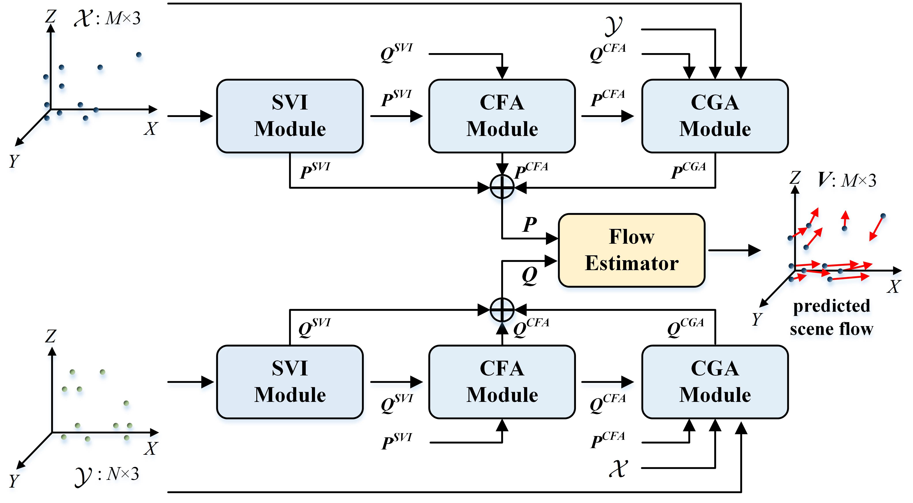

# FlowST-Net

**FlowST-Net**, our novel framework for uniform spatial and temporal feature learning in point clouds, designed to tackle non-uniform spatial and temporal distributions in scene flow estimation.



## Overview

FlowST-Net addresses the challenges of:

1. **Non-uniform spatial distributions** within a single frame.
2. **Non-uniform temporal distributions** between consecutive frames.

The architecture integrates:

- **SVI Module**: Extracts locally consistent and discriminative features within a frame.
- **CFA Module**: Captures dependencies between frames in feature space using cross-attention.
- **CGA Module**: Enhances geometric alignment through cross-frame nearest neighbor search.
- **Flow Estimator**: Computes scene flow with optimal transportation theory.

## Features

- End-to-end deep learning framework for scene flow estimation.
- Modules for handling non-uniform point cloud distributions.
- Robust performance in both dynamic and static scenarios.

## Prerequisities

Our models is trained and tested under:

- Python 3.6.9
- NVIDIAGPU+CUDA CuDNN
- PyTorch(torch==1.7.0)
- Minkowski Engine(MinkowskiEngine==0.5.4)
- tqdm
- numpy

Compile the furthest point sampling, grouping and gathering operation for PyTorch. We use the operation from this [repo](https://github.com/sshaoshuai/Pointnet2.PyTorch).

```
cd FPT_utils\cuda_ops
python setup.py install
cd ../../
```

## Data preparation

Please follow the instructions given in [HPLFlowNet](https://github.com/laoreja/HPLFlowNet) to construct the FlyingThings3D and KITTI datasets. Finally the directory structure should like this:

```
FlowST-Net
├── data
│   └── HPLFlowNet
│       ├── FlyingThings3D_subset_processed_35m
│       └── KITTI_processed_occ_final
├── datasets
├── images
├── FPT_utils
├── models
├── README.md
├── train.py
├── train_ddp.py
├── train_multi_process_GPUs.py
└── val_test.py
```

## Training

By default, one ```checkpoints``` directory will be created automatically. The tensorboard's logs and the checkpoints will be saved in this directory.

- To train FlowST-Net on FT3D using 8192 points:
  
  ```
  python -m torch.distributed.launch --nproc_per_node=4 ./FlowST-Net/train_ddp.py --nb_iter 1 --dataset HPLFlowNet --nb_points 8192 --batch_size 4 --nb_epochs 100
  ```

## Testing

One model trained on FT3D using 8192 points is provided in ```checkpoints/model-100.tar```.

- To evalaute one pretrained model on test set of FT3D:
  
  ```
  python val_test.py --dataset HPLFlowNet_FT3D --nb_points 8192 --path2ckpt checkpoints/model-100.tar
  ```

- To evalaute one pretrained model on KITTI dataset:
  
  ```
  python val_test.py --dataset HPLFlowNet_kitti  --nb_points 8192 --path2ckpt checkpoints/model-100.tar
  ```

## Acknowledgments

- [FLOT](https://github.com/valeoai/FLOT)
- [HPLFlowNet](https://github.com/laoreja/HPLFlowNet)
- [SCTN](https://github.com/hi-zhengcheng/sctn)
- [FPT](https://github.com/POSTECH-CVLab/FastPointTransformer)
